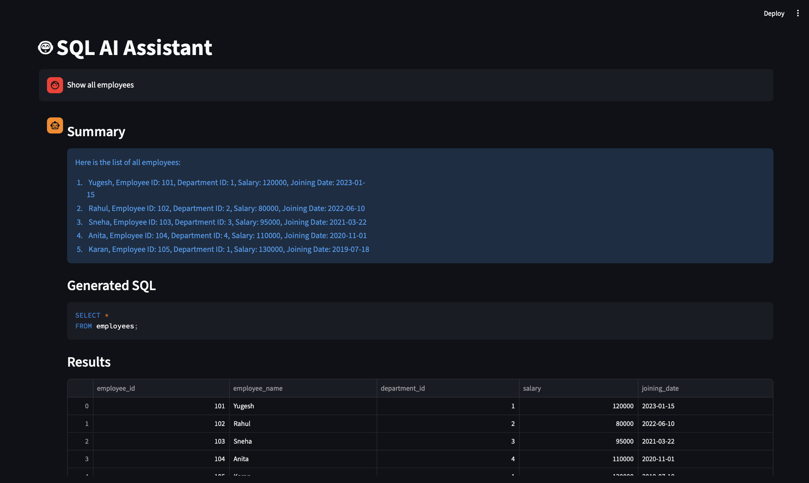
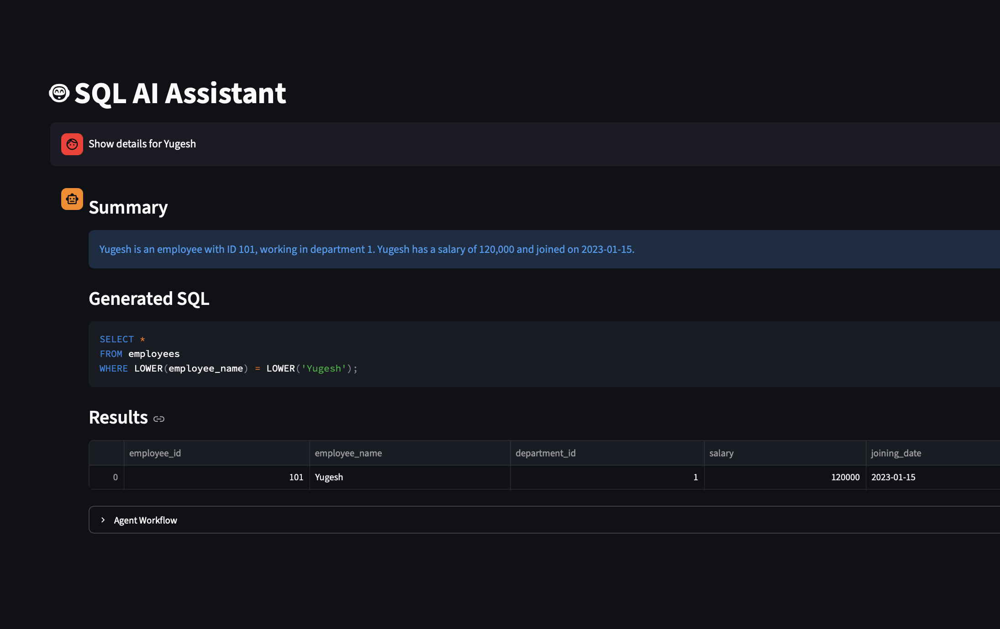
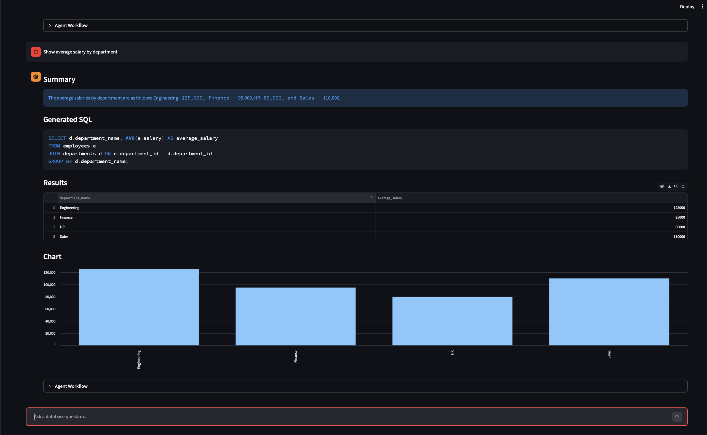

# 🤖 SQL AI Platform

An AI-powered conversational SQL assistant that allows users to query databases using natural language. The application uses LLMs, LangGraph workflows, conversational memory, SQL validation, self-correction, and automatic data visualization to provide an intelligent analytics experience.

---

# 🚀 Features

### Conversational SQL Queries

Ask questions in plain English:

```text
Show all employees

Who earns the most?

Which department does he belong to?
```

The system automatically generates and executes SQL queries.

---

### Conversational Memory

Supports follow-up questions by remembering previous interactions.

Example:

```text
Show details for Yugesh

Which department does he belong to?
```

The assistant resolves references such as:

* he
* she
* they
* that employee
* previous result

---

### Dynamic Schema Retrieval

Database schema is retrieved dynamically and supplied to the LLM at runtime.

This allows the assistant to understand:

* Available tables
* Available columns
* Relationships between entities

---

### SQL Validation & Guardrails

Generated SQL is validated before execution.

Protected against:

* DELETE
* DROP
* UPDATE
* INSERT
* ALTER
* TRUNCATE

Only safe SELECT queries are executed.

---

### Self-Correction Workflow

If invalid SQL is generated:

```text
Generate SQL
    ↓
Validate SQL
    ↓
Invalid
    ↓
Regenerate SQL
    ↓
Validate Again
```

The system automatically retries and corrects itself.

---

### Result Summarization

Query results are converted into natural language summaries.

Example:

```text
Engineering has the highest average salary of 125,000.
```

---

### Automatic Charts

Analytical results are automatically visualized.

Example:

```text
Show average salary by department
```

Results are displayed as:

* Table
* Bar Chart

---

# 🏗️ Architecture

```text
Streamlit UI
      ↓
FastAPI
      ↓
LangGraph Workflow
      ↓
Conversation Memory
      ↓
Schema Retrieval
      ↓
SQL Generation
      ↓
SQL Validation
      ↓
SQLite Database
      ↓
Result Summarization
      ↓
Visualization
```

---

# ⚙️ Tech Stack

### Backend

* Python
* FastAPI
* LangGraph
* OpenAI API
* SQLite

### Frontend

* Streamlit
* Pandas

### AI Components

* OpenAI GPT Models
* Prompt Engineering
* Conversational Memory
* Self-Correction
* SQL Validation

---

# 📂 Project Structure

```text
sql-ai-platform/

├── backend/
│   ├── app/
│   │   ├── agents/
│   │   ├── database/
│   │   ├── graphs/
│   │   ├── memory/
│   │   ├── prompts/
│   │   ├── routes/
│   │   ├── services/
│   │   └── main.py
│
├── frontend/
│   └── app.py
│
├── screenshots/
│
├── requirements.txt
├── README.md
└── .gitignore
```

---

# 📸 Screenshots

## Conversational Query



---

## Memory-Based Follow-up Query

(Screenshots/memory-query-2.png)
---

## Automatic Chart Generation


---

# ▶️ Running Locally

## Clone Repository

```bash
git clone https://github.com/<your-username>/sql-ai-platform.git

cd sql-ai-platform
```

---

## Create Virtual Environment

```bash
python -m venv venv
```

Activate:

### Windows

```bash
venv\Scripts\activate
```

### Mac/Linux

```bash
source venv/bin/activate
```

---

## Install Dependencies

```bash
pip install -r requirements.txt
```

---

## Configure Environment Variables

Create a `.env` file:

```env
OPENAI_API_KEY=your_api_key
```

---

## Start Backend

```bash
uvicorn app.main:app --reload
```

Backend:

```text
http://127.0.0.1:8000
```

---

## Start Frontend

```bash
streamlit run app.py
```

Frontend:

```text
http://localhost:8501
```

---

# 🔮 Future Enhancements

* PostgreSQL Support
* MySQL Support
* Role-Based Access Control
* Docker Deployment
* GitHub Actions CI/CD
* Cloud Deployment
* Advanced Visualizations
* Multi-Database Connectivity

---

# 🎯 Key Learnings

This project demonstrates:

* Agentic AI Workflows
* LangGraph State Management
* Conversational Memory
* Prompt Engineering
* SQL Validation
* FastAPI Development
* Streamlit Applications
* LLM-Based Data Analysis

---

# 📜 License

MIT License
